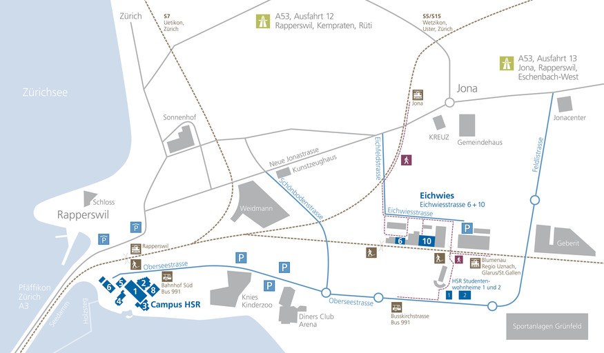

# How to reach us

## Address
Prof. Dr. Thomas Bocek  
IFS Institute for Software (IFS)  
HSR Hochschule für Technik Rapperswil  
University of Applied Sciences Rapperswil  
Oberseestrasse 10, CH-8640 Rapperswil, Switzerland  

## By Car
The nearest public car park is around ten minutes (walking distance) away. There is a local parking guidance system in place. There are only a few, paid parking spaces available close to the university with a maximum parking duration of 2 hours. The HSR parking garage can only be used by HSR members, from Monday to Friday, 6:00 to 17:00.
## By Train
HSR Hochschule für Technik Rapperswil is located next to the train station in Rapperswil. Rapperswil has a direct connection to Zurich with the [S15, S5, and S7](https://www.zvv.ch/zvv/en/timetable/network-maps.html). 

